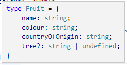

# typist

### Pleasant Runtime Types for JavaScript and TypeScript

Runtime types don't exist in JavaScript (or TypeScript) and there are lots of awful solutions that make you write hellish schemas.

typist was written to be a pleasant alternative to duplicating type knowledge across your codebase.

To make things nicer typist uses [@swan-io/boxed](https://swan-io.github.io/boxed/) to make handling the unhappy path as much fun as the happy path. No null checks, no accidental nulls!

Where TypeScript has you **declare** types, typist let's you **create** them: `type Thing = {...}` becomes `const ThingModule = type({...})`!

## How To: A Fruit Type

### 1: Create a Type

Let's look at a verbose example of a `Fruit` type.

Without typist, we might start with a type definition:

```TypeScript
type Fruit = {
    name: string
    colour: string
    countryOfOrigin: string
    tree?: string
}
```

With typist we won't define a `type`. Instead, we're going to create a type module by invoking `type()` as a function. This type module gives us safe ways to create, validate, and parse instances of `Fruit`.

Import the `type()` function and pass it a type description:

```TypeScript
import { type, types } from "@curlyben/typist"
const { string, optional } = types

const FruitModule = type({
    name: string,
    colour: string,
    countryOfOrigin: string,
    tree: optional(string),
})
```

The `type?` optional fields have been rewritten as `optional(type)`. This is because typist uses functions to build types while keeping the syntax as close as possible to the type syntax of TypeScript.

You'll also notice in the above example that there isn't an exportable fruit type. We don't always need a type, but if we do, we can capture one with the `InputOf<T>` or `TypeFrom<T>` utility. 

```TypeScript
import { InputOf } from "@curlyben/typist"

// either
export type Fruit = InputOf<typeof FruitModule.create>
// ...or
export type Fruit = TypeFrom<typeof FruitModule>
```

In your IDE you'll notice that hovering over `Fruit` reveals that it is the shape you would expect:




### 2: Use a Type

```TypeScript
export type Fruit = TypeFrom<typeof FruitModule>
const { create: fruit } = FruitModule;

// use the create function to get a Result<Fruit, Error>:
const apple = fruit({
    name: "apple",
    colour: "green",
    countryOfOrigin: "spain"
})

// use the native type you extract with TypeFrom<FruitModule>:
const orange: Fruit = {
    name: "orange",
    colour: "orange",
    countryOfOrigin: "spain"
}

// validate a Result<Fruit, Error> with match:
apple.match({
    Ok: apple => eat(apple),
    Error: error => yell(error),
})

// use the create function to validate a native type:
if (fruit(orange).isOk()) {
    eat(orange)
} else {
    yell(new Error("something went wrong"))
}

```

```

// 2.5: create things
export type Fruit = InputOf<typeof createFruit>
const orange = {
    name: "orange",
    colour: "orange",
    countryOfOrigin: "spain"
}
// ...and use them safely
validateFruit(orange).match({
    Ok: orange => makeJuice(orange),
    Error: error => yell(error),
})

// 2.75: create things
const banana = {
    name: "banana",
    colour: "yellow",
    countryOfOrigin: ["indonesia", "philippines"]
}
// ...and use them safely
validateFruit(banana).match({
    Ok: banana => peel(banana),
    Error: error => yell(error),
})
```